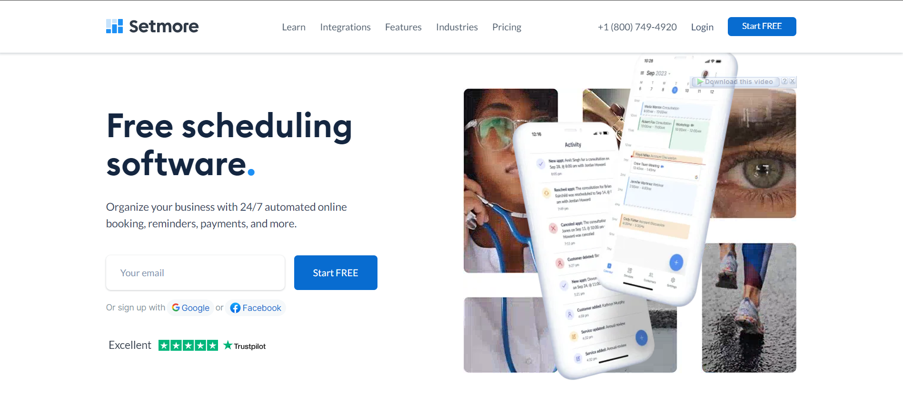
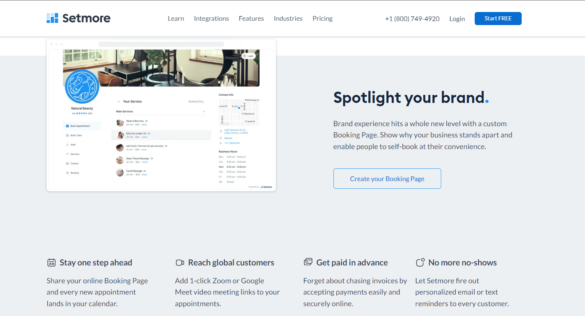
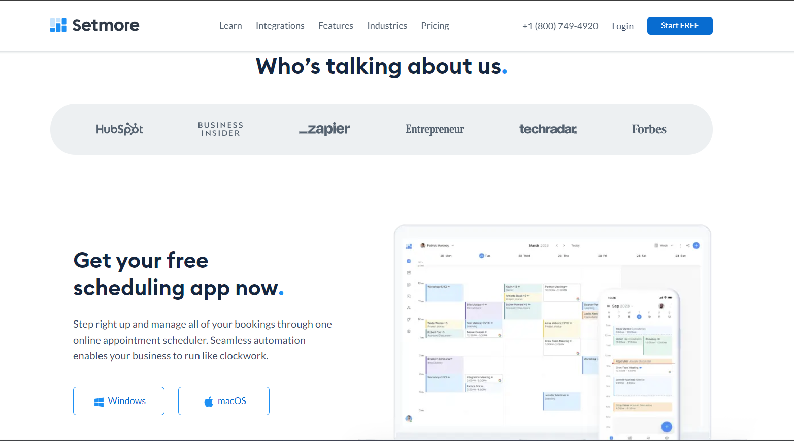
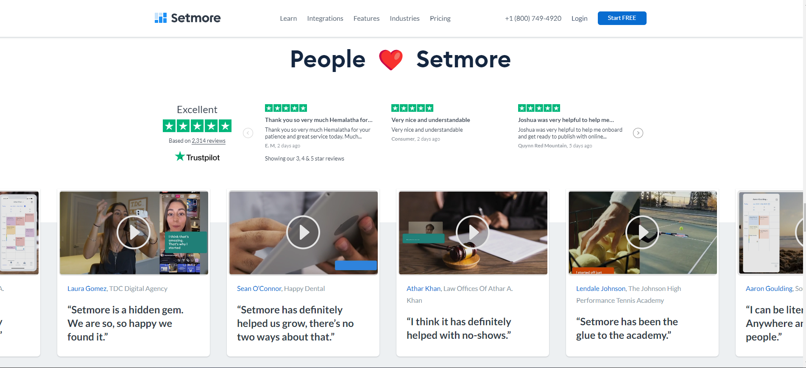
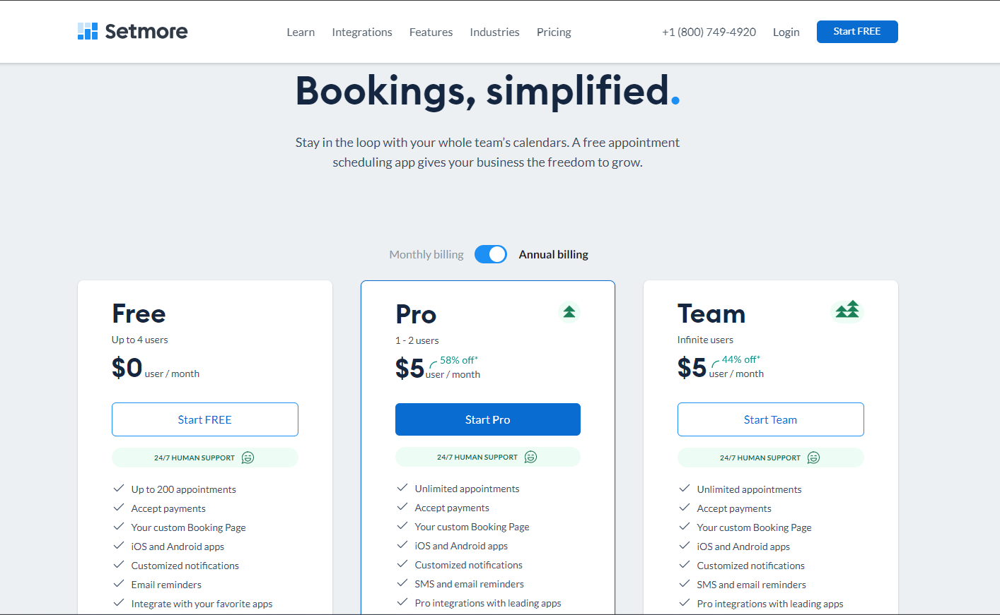
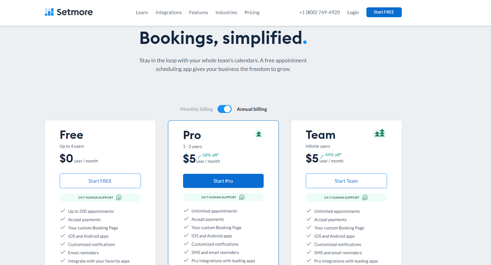

# Custom Appointment Management System

## Introduction
The Custom Appointment Management System is designed to streamline the process of scheduling appointments between patients and doctors. This solution is tailored to meet the specific requirements of a healthcare provider, featuring a sophisticated administrative panel, integrated payment solutions, and support for real-time consultations via Skype.

## Key Features
- **Admin Panel:** A powerful dashboard for managing all appointment-related activities.
- **Patient Portal:** Allows patients to log in, submit their information, and book appointments.
- **Payment Integration:** Utilizes Stripe for secure and efficient payment processing.
- **Skype Integration:** Enables direct audio or video calls between doctors and patients at the scheduled time.

## Technologies Used
- **Frontend:** HTML, CSS, JavaScript
- **Backend:** Django
- **APIs:** Stripe for payments
- **Others:** Skype for communication

## Screenshots
Here are some visuals of the Custom Appointment Management System in action:









## Installation
To set up the project on your local machine, follow these steps:

1. Clone the repository:
   ```bash
   git clone https://github.com/faheemshahzad6/Custom-Appointment-Management-System.git
